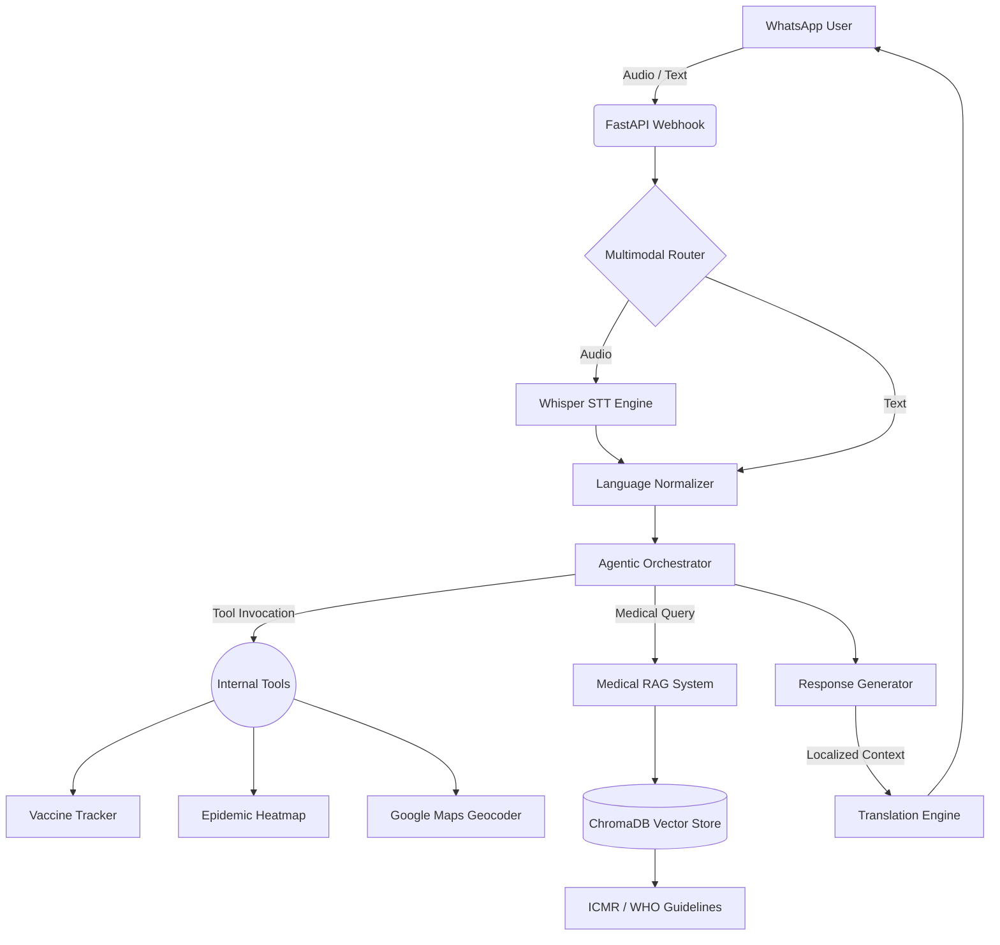

# 🌿 Jeevo: Multimodal Agentic Health Platform for Rural India

[](https://www.python.org/)
[](https://fastapi.tiangolo.com/)
[](https://www.postgresql.org/)
[](https://www.docker.com/)
[](https://opensource.org/licenses/MIT)

**Jeevo** is an intelligent, voice-first health assistant deployed entirely over WhatsApp. It bridges the digital healthcare divide in rural India by providing localized medical guidance, automated health alerts, and clinical tracking in **10 regional languages**.

Unlike simple prompt-wrappers, Jeevo operates on a sophisticated **Agentic LLM Orchestrator**. It intelligently classifies unstructured audio/text, autonomously invokes Python toolsets (like nearby hospital lookups or localized epidemic heatmaps), and grounds all medical responses using a **ChromaDB RAG Pipeline** queried against verified clinical guidelines (WHO/ICMR).

---

## 🎯 The Problem & The Solution

**The Problem:** 
In rural India, millions lack immediate access to primary healthcare, reliable medical information, and preventive care alerts. Low literacy rates and complex app interfaces further alienate this demographic. 

**The Solution:** 
Jeevo meets users where they already are: **WhatsApp**. By heavily emphasizing **Voice-to-Text (Whisper STT)** and localized translation engines, users can simply send a voice note in Hindi or Marathi saying *"My child has a high fever and rash,"* and the AI will autonomously extract symptoms, perform a severity triage, query medical databases, and respond with contextual voice notes and emergency numbers.

---

## 🧠 Core AI Architecture (For the Tech Reviewer)

Jeevo demonstrates production-ready applied AI, separating prompt engineering from deterministic business logic.



### 1. Agentic Intent Engine & Tool Calling
Jeevo uses **Groq's high-speed Llama models** as the core reasoning engine. It evaluates user inputs and decides whether to invoke deterministic Python tools or answer directly.
- **Entity Extraction:** Dynamically parses complex rural addresses, ages, and symptoms from messy conversational inputs.
- **Tool Mapping:** Dynamically invokes tools like `check_symptoms`, `find_hospitals`, `check_vaccination_schedule`, or `get_first_aid`.

### 2. Medical RAG (Retrieval-Augmented Generation)
- **Vector Search Engine:** Employs **ChromaDB** with lightweight embeddings (`sentence-transformers/all-MiniLM-L6-v2`) to index verified medical datasets.
- **Safety Validations:** When the LLM generates a response, it is verified against the RAG context. If confidence falls below `0.6` (`RAG_CONFIDENCE_THRESHOLD_MEDIUM`), the AI automatically triggers a fallback disclaimer advising clinical consultation.

### 3. Asynchronous Voice-First Pipeline
- **Parallel Processing:** Integrated Whisper STT seamlessly decodes regional dialects into actionable text asynchronously, preventing webhook timeouts.
- **Adaptive Fallbacks:** If the AI determines the user has low literacy (based on input style), it generates Voice Note responses via **ElevenLabs TTS** instead of long text blocks.

### 4. Zero-Slop Clean Architecture
- **Dependency Injection:** Database connections utilize **SQLAlchemy 2.0 AsyncSessions** injected directly into repository instances.
- **Transactional Safety:** 100% of data mutations are wrapped in `try/except/rollback` blocks.
- **Externalized Datasets:** All static data (vaccine schedules, lab tests, anganwadi centers) are abstracted into `/app/resources/*.json` files. No hardcoded logic.

---

## 🚀 Quick Start (Local Setup)

Jeevo is container-ready. You can deploy the entire stack locally using Docker.

### Prerequisites
- Docker & Docker Compose
- Groq API Key
- WhatsApp Cloud API Credentials
- (Optional) Google Maps API Key, OpenWeather API Key

### Step-by-step Setup

1. **Clone the Repository**
```bash
git clone https://github.com/your-username/jeevo.git
cd jeevo
```

2. **Configure Environment Variables**
Copy the example environment file and fill in your keys:
```bash
cp .env.example .env
```
*Crucial Keys:* `GROQ_API_KEY`, `WHATSAPP_ACCESS_TOKEN`, `DATABASE_URL` (if running outside Docker).

3. **Launch the Stack with Docker Compose**
This spins up the FastAPI web server, the PostgreSQL database, and the Redis cache.
```bash
docker-compose up -d --build
```

4. **Verify Application**
Visit `http://localhost:8000/docs` to access the interactive Swagger API documentation.

---

## 📂 Project Structure

```
jeevo/
├── app/
│   ├── ai/                # Whisper STT, LLM Orchestration logic
│   ├── database/          # Async SQLAlchemy Repositories & Connections
│   ├── locales/           # i18n JSON files for 10 regional languages
│   ├── logic/             # Message routing and parsing logic
│   ├── models/            # SQLAlchemy ORM schemas
│   ├── resources/         # Static datasets (Vaccine DB, Lab Tests, etc.)
│   ├── routes/            # Webhooks and API endpoints
│   ├── services/          # Business logic (Hospitals, Heatmap, RAG)
│   └── utils/             # Webhook validation, logging, cache setup
├── medical_rag/           # Context documents for vector indexing
├── server.py              # Application entry point
├── docker-compose.yml     # Container orchestration
└── README.md
```

---

## 📈 Future Roadmap

1. **Integration with ABDM (Ayushman Bharat Digital Mission):** Allow users to pull basic health records securely.
2. **Vision Capabilities:** Allow users to send pictures of medical prescriptions or basic skin rashes for OCR and localized translation.
3. **Proactive Outbreak Paging:** Use Celery to batch-process daily alerts to user segments affected by sudden AQI drops or local Dengue outbreaks.

---

## 🤝 Contribution & License

Contributions are welcome! Please ensure that all database queries are routed through the instantiated repositories in `app/database/repositories.py` and wrapped in transactional rollback safety blocks.

Distributed under the MIT License. See `LICENSE` for more information.
